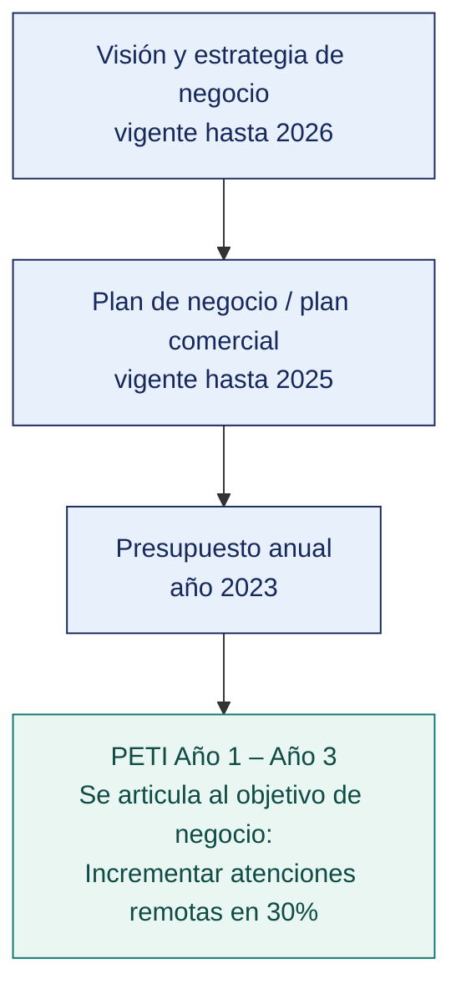

## 1.2 Marco de planeamiento y articulación de instrumentos

### 1.2.1 Instrumentos de planeamiento de la organización
La organización cuenta con los siguientes instrumentos formales de planeamiento vigentes:

| Instrumento | Vigencia | Aprobación |
|---|---|---|
| Visión y estrategia de negocio | 2022-2026 | Directorio |
| Plan de negocio / comercial | 2023-2025 | Directorio |
| Presupuesto anual | 2023 | Gerencia General |

### 1.2.2 Mapa de articulación
A continuación, se presenta la articulación de los instrumentos de planeamiento de la organización:

### 1.2.3 Objetivo superior de enganche
El presente PETI se articula al objetivo de negocio: **"Incrementar las atenciones remotas en un 30% a través de canales digitales"**.  
*Justificación:* Este objetivo comercial no puede lograrse sin una infraestructura tecnológica robusta de telemedicina, siendo TI el habilitador directo.

### 1.2.4 Enfoque estratégico de la organización
La organización crea valor mediante la **cercanía al cliente**, dirigido a **pacientes de nivel socioeconómico A, B y C**, sostenido en **la personalización del servicio médico y rapidez de atención**. En este marco, la tecnología de información cumple un rol **estratégico**, y este plan concentra sus esfuerzos en **la implementación de telemedicina y digitalización de historias clínicas**, postergando explícitamente **la renovación de infraestructura de oficinas administrativas que no impacten directamente en el servicio al paciente**.

### 1.2.5 Marco normativo de planeamiento aplicable
Para esta organización del sector privado, el marco de referencia adoptado voluntariamente incluye mejores prácticas de COBIT 2019 para gobierno de TI e ITIL 4 para gestión de servicios, alineado al plan de negocio institucional.

### 1.2.6 Referencia metodológica: análisis comparado
El análisis del PEI y PGD de SUNAT revela que el 100% de los objetivos del PGD se articulan formalmente con los OEI institucionales (como el OEI 02 para facilitación de servicios) y poseen metas claras.  
**Lección aprendida que se replica:** Todos los proyectos de TI en este PETI tendrán un objetivo de negocio asociado explícito y métricas de impacto tecnológico y comercial.  
**Defecto que se evita deliberadamente:** Aunque el PGD de SUNAT es robusto, la ausencia de una evaluación y actualización anual formal del portafolio se evitará incluyendo ciclos trimestrales de revisión del PETI en nuestra organización.
